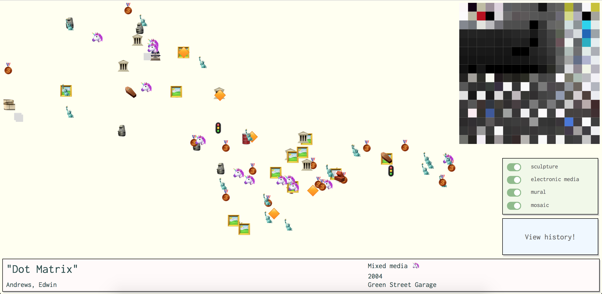

# Public art data visualization with React, D3, and canvas

## App preview

Best enjoyed at 1280x625 screen! :P

## Inspiration
When I was traveling in Nantes, France, I got to explore its beautiful collection of public artworks (sculptures, machines, architecture). However, it was almost impossible to avoid seeing what the works look like when preparing for the trip. Although it was still a pleasant journey, my prior research really ruined the surprise of what Nantes has to offer.

Therefore, with the public art dataset available on Cambridge Open Data, I decided to create a map visualization that does not only list all locations but also unveils part of the works in various ways without explicitly showing its look in the beginning. In order to prepare viewers with what to expect on site, a color palette is generated from an image of the selected work with the use of D3. The material of each work is also represented by an emoji spread throughout the map. Because emojis often feature common or well-known things, using these symbols that people are mostly familiar with creates a rather tangible dimension to the works as compared to plain text. These interactions are designed in a way such that viewers feel a closer connection to the works before their visit.

## Explanation
The interface can be divided to several components: map, mosaic (color palette), toggle switches for categories, button to view history, and an information section for the works' details.

As the program loads, *loadData()* obtains public art dataset from [https://raw.githubusercontent.com/cambridgegis/cambridgegis_data/master/Landmark/Public_Art/LANDMARK_PublicArt.geojson](https://raw.githubusercontent.com/cambridgegis/cambridgegis_data/master/Landmark/Public_Art/LANDMARK_PublicArt.geojson) in json format and extracts useful data and stores as state variables. Because the x and y coordinates of each node in geojson dataset are with respect to global context, I found the maximum and minimum of points in this particular set and mapped the locations to screen size.

The map is drawn with *drawMap()*. It takes state variable *coordinates* array and draws nodes with material-based emojis and binds a 'click' event listener to display details and load image for the mosaic. Because 'react-emoji-render' tool only supports rendering emojis with a ReactComponent, it is not compatible with D3 and svg and hence I simply appended images of emojis to the svg.map element. To understand the timeline of the public art collection in Cambridge, *sortCoords()* sorts the *coordinates* array based on its year of creation and the 'view history' button calls *viewHistory()* and shows the nodes in ascending order.

*loadImage()* relies on canvas to get pixel-wise image data. Once image is loaded, *startTimer()* is called to repeatedly trigger *drawImage()*, which selects pixels to draw based on increasing resolution to generate the mosaic. I need to admit that the color palette is a bit of a hack - instead of picking the most dominant color from each area of the image, I simply selected the first pixels of each area. Since this is just a proof-of-concept exercise, I will just leave it like this for now.

*updateNodes()* is the function that updates *coordinates* array when any of the toggle switch has change in state. It removes or adds corresponding nodes based on the works' category, sort the array and redraws the map. To avoid breaking of program, the switches are disabled when the 'view history' animation is playing. Last but not least, if viewers would really want to know more about the work, they could press the mosaic element to read the work description (if available in dataset) as well as see the full image of work.

## Timeline
- Dec 21 2018: learn React, select dataset
- Dec 22 2018: data collection (images), learn d3, draw nodes on map
- Dec 23 2018: load image with canvas, draw image like mosaic, animate
- Dec 24-29 2018: take break, brainstorm and design for interface
- Dec 30 2018: refine code with design, add emoji support
- Jan 2 2018: add toggle switches and view history button
- Jan 3 2018: add description on mousedown, write report

## How to run
Run `npm start` or `yarn start` to run app in dev mode. Open [http://localhost:3000](http://localhost:3000) to view it in the browser.
